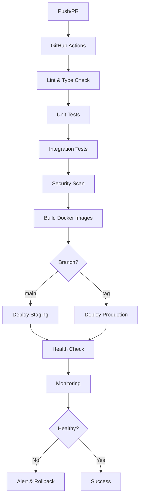

# 🔄 CI/CD Pipeline Documentation

## 📋 Visão Geral

Este documento descreve o pipeline completo de CI/CD implementado para o SAAS Personal Trainer, incluindo práticas de desenvolvimento, testes automatizados, deploy containerizado e monitoramento contínuo.

## 🏗️ Arquitetura do Pipeline



## 🔄 Workflows GitHub Actions

### 1. CI/CD Principal (`ci-cd.yml`)

**Triggers:**
- Push para `main` ou `develop`
- Pull Requests para `main` ou `develop`
- Dispatch manual

**Jobs:**

#### 🧪 Test & Quality
- **Matrix Strategy**: api, web, mobile
- **Steps**:
  1. Checkout code
  2. Setup Node.js 18.x
  3. Install dependencies
  4. Lint code (fail on error)
  5. Build application
  6. Run tests
  7. Generate coverage report (API only)
  8. Upload to Codecov

**Quality Gates:**
- Lint deve passar sem erros
- Build deve ser bem-sucedido
- Todos os testes devem passar
- Cobertura de testes >70%

#### 🔒 Security Scan
- **Trivy** vulnerability scanner
- **npm audit** dependency check
- Upload results to GitHub Security

#### ✅ Quality Gate (PR only)
- Verifica cobertura de testes
- Comenta no PR com métricas
- Bloqueia merge se não atingir 70%

#### 🐳 Build Images (main only)
- Build multi-stage Docker images
- Push para GitHub Container Registry
- Cache layers para otimização

#### 🚀 Deploy Staging (main only)
- Deploy automático para staging
- Health checks
- Smoke tests

#### 🌟 Deploy Production (main only)
- Requer aprovação manual
- Rolling update sem downtime
- Post-deployment verification

### 2. Pull Request Validation (`pr-validation.yml`)

**Triggers:**
- PRs opened/synchronized/reopened

**Features:**
- Validação rápida de builds
- Code review automático
- Performance analysis
- Bundle size checks

### 3. Release & Deploy (`release.yml`)

**Triggers:**
- Tags `v*.*.*`
- Manual dispatch

**Features:**
- Criação automática de releases
- Changelog gerado automaticamente
- Build de imagens versionadas
- Deploy multi-ambiente

### 4. Monitoramento (`monitoring.yml`)

**Schedule:**
- A cada 15 minutos

**Features:**
- Health checks automáticos
- Performance monitoring
- Database health
- Alertas em caso de falha

## 🐳 Containerização

### Estratégia Multi-Stage

#### API Container
```dockerfile
# Stage 1: Build
FROM node:18-alpine AS builder
# Install deps + build

# Stage 2: Production
FROM node:18-alpine AS production
# Copy built app + run
```

#### Web Container
```dockerfile
# Stage 1: Build React
FROM node:18-alpine AS builder
# Build React app

# Stage 2: Nginx serve
FROM nginx:alpine AS production
# Serve static files
```

### Container Features
- **Security**: Non-root user, security updates
- **Health Checks**: Built-in endpoint monitoring
- **Optimization**: Multi-stage builds, layer caching
- **Metadata**: Labels com build info

## 🚀 Estratégias de Deploy

### Environment Matrix

| Environment | Branch | Approval | Monitoring |
|-------------|--------|----------|------------|
| Development | feature/* | Auto | Basic |
| Staging | main | Auto | Full |
| Production | tags | Manual | Enhanced |

### Rolling Updates

1. **Build**: Novas imagens com tags
2. **Health Check**: Verificação de saúde
3. **Deploy**: Update incremental dos containers
4. **Verification**: Testes pós-deploy
5. **Rollback**: Automático em caso de falha

### Zero-Downtime Strategy

```bash
# 1. Deploy new API version
docker-compose up -d --no-deps api

# 2. Wait for health check
wait_for_health "api"

# 3. Deploy web version  
docker-compose up -d --no-deps web

# 4. Verify complete deployment
verify_deployment
```

## 📊 Quality Gates

### Critérios de Aprovação

#### Development → Staging
- ✅ Todos os testes passam
- ✅ Lint sem erros
- ✅ Build bem-sucedido
- ✅ Cobertura >70%
- ✅ Security scan limpo

#### Staging → Production
- ✅ Deploy staging bem-sucedido
- ✅ Smoke tests passam
- ✅ Performance dentro dos limites
- ✅ Aprovação manual
- ✅ Health checks OK

### Métricas Monitoradas

| Métrica | Limite | Ação |
|---------|--------|------|
| Test Coverage | >70% | Block merge |
| Response Time | <2s | Warning |
| Error Rate | <1% | Alert |
| Uptime | >99.9% | Escalate |

## 🔒 Segurança

### Scans Automáticos
- **Trivy**: Container vulnerabilities
- **npm audit**: Dependency vulnerabilities  
- **CodeQL**: Code analysis
- **Secrets**: Credential scanning

### Secrets Management
- GitHub Secrets para credentials
- Environment-specific variables
- Rotation automática quando possível

### Access Control
- Branch protection rules
- Required reviews
- Status checks obrigatórios
- Deploy approval gates

## 📈 Monitoramento & Observabilidade

### Health Checks
```bash
# API Health
GET /api/health
-> 200 OK {"status": "healthy"}

# Web Health  
GET /health
-> 200 OK "healthy"

# Database Check
pg_isready -U postgres
```

### Métricas Coletadas
- **Application**: Response time, error rate, throughput
- **Infrastructure**: CPU, memory, disk, network
- **Business**: Active users, API calls, features usage

### Alerting Strategy

#### Channels
- 🔔 Slack notifications
- 📧 Email alerts  
- 🐛 GitHub issues (incidents)
- 📊 Dashboard alerts

#### Severity Levels
- **P0 Critical**: Production down
- **P1 High**: Degraded performance  
- **P2 Medium**: Warning thresholds
- **P3 Low**: Informational

## 🛠️ Scripts de Automação

### Deploy Script (`scripts/deploy.sh`)

```bash
# Uso básico
./scripts/deploy.sh [environment] [version] [command]

# Exemplos
./scripts/deploy.sh staging v1.2.3 deploy
./scripts/deploy.sh production v1.2.3 rollback
./scripts/deploy.sh development latest build
```

**Features:**
- ✅ Prerequisites check
- 🧪 Automated testing
- 🐳 Docker build & push
- 🚀 Multi-environment deploy
- 🔄 Rollback capability
- 📊 Health monitoring

### NPM Scripts Integration

```json
{
  "scripts": {
    "ci:check": "lint + typecheck + test",
    "docker:build": "Build Docker images",
    "deploy:staging": "Deploy to staging",
    "deploy:prod": "Deploy to production"
  }
}
```

## 🔄 Workflow de Desenvolvimento

### Feature Development
1. 🌿 Create feature branch
2. 💻 Develop + test locally
3. 📤 Push changes
4. 🔍 Automated PR validation
5. 👥 Code review
6. ✅ Merge to main
7. 🚀 Auto-deploy to staging

### Release Process
1. 🏷️ Create release tag
2. 📦 Build release artifacts
3. 📝 Generate changelog
4. 🚀 Deploy to production
5. 📊 Monitor release
6. 📚 Update documentation

### Hotfix Process
1. 🚨 Create hotfix branch from main
2. 🔧 Implement critical fix
3. ⚡ Fast-track testing
4. 🚀 Emergency deploy
5. 📝 Post-incident review

## 📚 Troubleshooting

### Common Issues

#### Build Failures
```bash
# Check logs
docker-compose logs api

# Rebuild without cache
docker build --no-cache

# Check dependencies
npm audit
```

#### Deploy Failures
```bash
# Check health status
curl -f http://localhost:3001/api/health

# View container logs
docker logs pt-api-prod

# Manual rollback
./scripts/deploy.sh production v1.2.2 rollback
```

#### Test Failures
```bash
# Run tests locally
npm run test:coverage

# Check coverage report
open coverage/lcov-report/index.html

# Debug specific test
npm test -- --testNamePattern="auth"
```

### Performance Issues

#### Slow Builds
- ✅ Enable Docker layer caching
- ✅ Optimize Dockerfile stages
- ✅ Use npm ci instead of install

#### Slow Tests
- ✅ Run tests in parallel
- ✅ Mock external dependencies
- ✅ Use test databases

## 🎯 Métricas de Sucesso

### Pipeline Performance
- **Build Time**: <5 minutos
- **Test Execution**: <3 minutos  
- **Deploy Time**: <2 minutos
- **Recovery Time**: <5 minutos

### Quality Metrics
- **Test Coverage**: >70%
- **Bug Escape Rate**: <1%
- **Security Vulnerabilities**: 0 high/critical
- **Performance Regression**: 0%

### Business Metrics
- **Deployment Frequency**: Daily
- **Lead Time**: <2 horas
- **MTTR**: <15 minutos
- **Change Failure Rate**: <5%

## 🔮 Roadmap

### Próximas Melhorias
- [ ] **Progressive Deployment**: Canary releases
- [ ] **Advanced Monitoring**: APM integration
- [ ] **Infrastructure as Code**: Terraform
- [ ] **Multi-Region**: Geographic distribution
- [ ] **Auto-Scaling**: Container orchestration
- [ ] **Chaos Engineering**: Resilience testing

### Integrações Planejadas
- [ ] **Kubernetes**: Container orchestration
- [ ] **ArgoCD**: GitOps deployment
- [ ] **Istio**: Service mesh
- [ ] **Jaeger**: Distributed tracing
- [ ] **ELK Stack**: Centralized logging

---

**Documentação mantida por**: DevOps Team
**Última atualização**: 19 de agosto de 2025
**Versão**: 1.0.0
